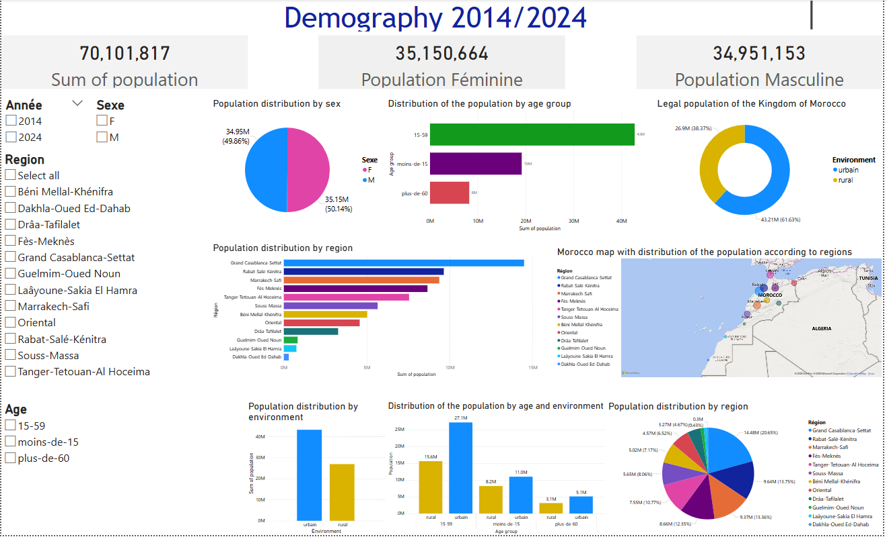
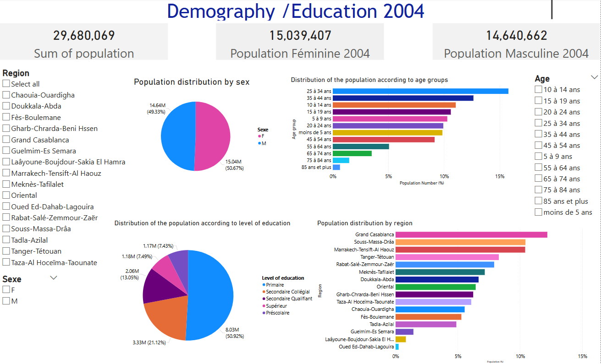
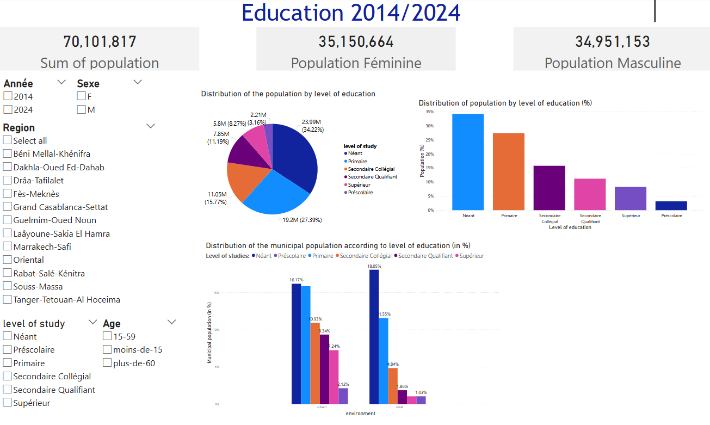

# Moroccan Census Data Visualization (2004–2024)

## 🌟 **Project Overview**  
This project focuses on the **visualization of Moroccan census data** for the years **2004, 2014, and 2024**, with a particular emphasis on **demographics** and **education levels**.  
The data was extracted from the **HCP (Haut Commissariat au Plan)** website, transformed using **Pentaho Data Integration**, and visualized with **Power BI** to create clear, actionable insights.

---

## 🗂️ **Project Structure**
Here’s how the project is organized:  

- **`data/`**: Contains raw and processed data.  
  - `raw/`: Original data extracted from the HCP website.  
  - `processed/`: Transformed data ready for analysis.  
- **`scripts/`**: Includes all transformation and visualization scripts.  
  - `data_transformation/`: Pentaho transformation files (`.ktr`).  
  - `visualization/`: Scripts related to Power BI dashboards.  
- **`docs/`**: Documentation and multimedia files.  
  - `images/`: Screenshots of visualizations.  

---

## 📊 **Key Features**  
### 1. **Data Transformation**  
- Extracted raw data using **Pentaho Data Integration** to clean, transform, and format the datasets for analysis.  
- Applied calculations and filters to ensure data accuracy.  

### 2. **Visualizations in Power BI**  
- **Demographic Analysis**: Age distribution, gender ratios, and population growth.  
- **Education Trends**: Literacy rates and education level distribution.  
- Interactive dashboards make it easy to explore trends at the national and regional levels.

---

## 🔧 **How to Use This Project**  
1. Clone this repository:  
   ```bash
   git clone https://github.com/chaymaazahedi/Moroccan-Census-Visualization.git
   cd Moroccan-Census-Visualization
2. Open the Pentaho `.ktr` files in **Pentaho Data Integration** for data transformation.  
3. Access the Power BI `.pbix` file to explore the dashboards.  

---

## 🌍 **Screenshots of the Dashboards**  

### Demographic Overview  
  


### Education Trends  
  

---

## 🤝 **Contributions**  
Contributions are welcome! Feel free to submit issues or pull requests to enhance this project.  

---

## 📜 **Acknowledgments**  
- **[Haut Commissariat au Plan (HCP)](https://www.hcp.ma/)** for providing the data.  
- Tools used:  
  - [Pentaho Data Integration](https://www.hitachivantara.com/en-us/products/data-management-analytics/pentaho-platform.html)  
  - [Power BI](https://powerbi.microsoft.com/)  